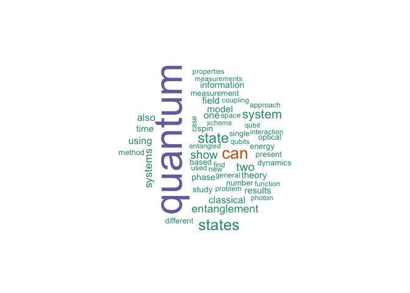
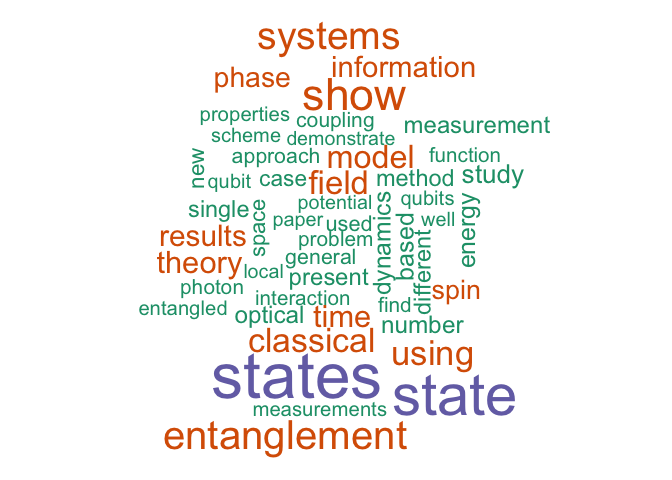
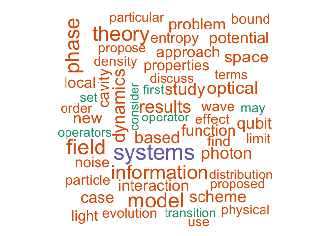
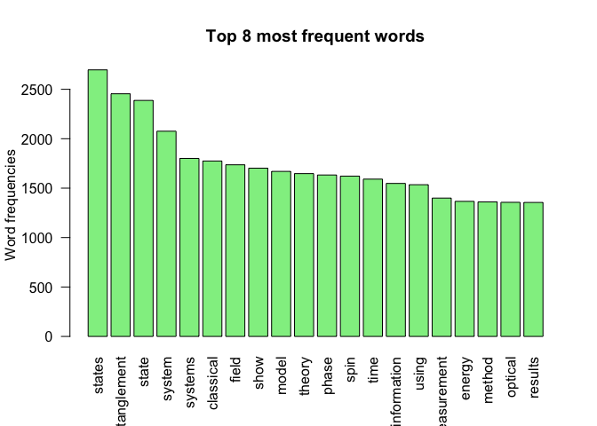
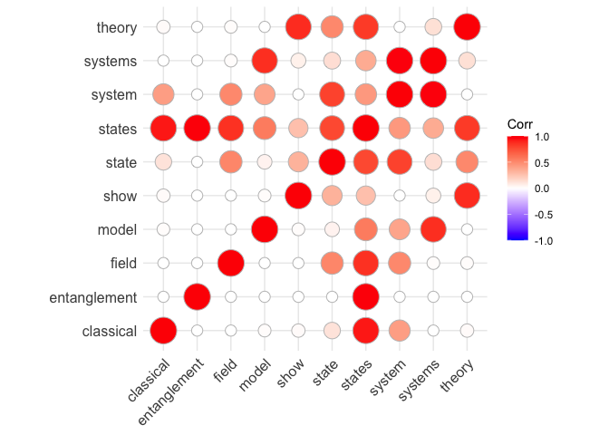
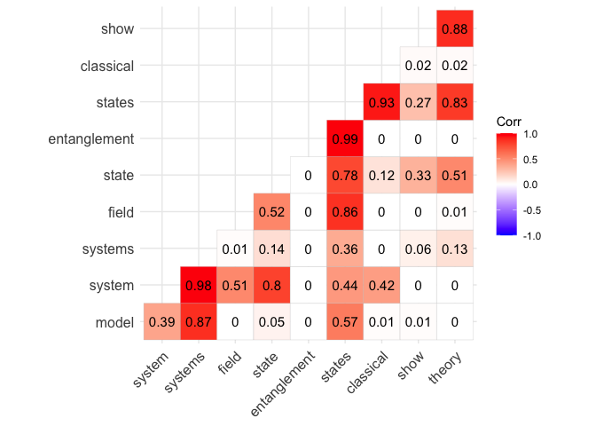
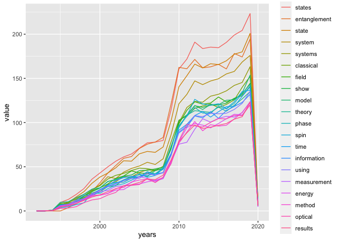

Text Analysis of ArXiv Quantum Articles
================

This data was taken from
[Kaggle](https://www.kaggle.com/louise2001/quantum-physics-articles-on-arxiv-1994-to-2009)
just for the craic. I’m doing this mostly just for practice as its been
a while since I used R! Since quantum physics is hard, maybe I can just
study the words used in the abstracts?

## Import and Explore

``` r
setwd("~/Documents/GitHub/ArXiv/ArXiv-Quantum")
arxiv_old <- read.csv("ArXiv_old.csv",header = TRUE)
arxiv1 <- read.csv("ArXiv.csv",header = TRUE)
arxiv2 <- read.csv("ArXiv 2.csv",header = TRUE)
```

Merge the datasets:

``` r
arxiv <- rbind(arxiv_old, arxiv1, arxiv2)
str(arxiv)
```

    ## 'data.frame':    173500 obs. of  6 variables:
    ##  $ title     : chr  "A limit relation for entropy and channel capacity per unit cost" "Visualizing Teleportation" "Lower ground state due to counter-rotating wave interaction in trapped\n  ion system" "A Single Trapped Ion as a Time-Dependent Harmonic Oscillator" ...
    ##  $ abstract  : chr  "In a quantum mechanical model, Diosi, Feldmann and Kosloff arrived at a\nconjecture stating that the limit of t"| __truncated__ "A novel way of picturing the processing of quantum information is described,\nallowing a direct visualization o"| __truncated__ "We consider a single ion confined in a trap under radiation of two traveling\nwaves of lasers. In the strong-ex"| __truncated__ "We show how a single trapped ion may be used to test a variety of important\nphysical models realized as time-d"| __truncated__ ...
    ##  $ categories: chr  "['quant-ph', 'cs.IT', 'math.IT']" "['physics.ed-ph', 'quant-ph']" "['quant-ph']" "['quant-ph']" ...
    ##  $ created   : chr  "2007-04-01" "2007-04-02" "2007-04-01" "2007-04-02" ...
    ##  $ id        : chr  "0704.0046" "0704.0051" "0704.0117" "0704.0135" ...
    ##  $ doi       : chr  "10.1063/1.2779138" "" "10.1088/0953-4075/40/11/002" "10.1103/PhysRevA.76.052105" ...

173500 rows and 6 variables. For this analysis, we’ll focus mostly on
the abstract, trying to identify recurrence of key terms and phrases
over time. So lets take a random abstract and see what we’re working
with.

``` r
arxiv[sample(nrow(arxiv), 1),2]
```

    ## [1] "It is proven that none of the bands in the quasi-energy spectrum of the\nQuantum Kicked Rotor is flat at any primitive resonance of any order.\nPerturbative estimates of bandwidths at small kick strength are established for\nthe case of primitive resonances of prime order. Different bands scale with\ndifferent powers of the kick strength, due to degeneracies in the spectrum of\nthe free rotor."

Lets remove the new line command. We should import stringr at this
point.

Now check out a random abstract:

``` r
arxiv[sample(nrow(arxiv), 1),2]
```

    ## [1] "The behavior of quantum speed limit time (QSLT) for a single free spin $-1/2$ particle described by Gaussian wavepackets in the framework of relativity under dephasing noise is investigated. The dephasing noise acts only on the spin degrees of freedom of the spin$-1/2$ particle. In particular, the effects of initial time parameter, rapidity, average momentum and the size of the wavepackets in the presence of the dephasing noise on the dynamics of evolution process are studied. In general, the effects of relativity monotonically decrease the QSLT in time. In the range of large values of average momentum, critical values of both the rapidity and the size of the wavepackets exist at which the QSLT has its minimum value. In the range of small values of the average momentum, the QSLT monotonically decreases with both rapidity and the size of the wavepackets. The decrease of QSLT in a particular range of rapidity and with other relative parameters may be of great interest in employing fast quantum communication and quantum computation."

Cool. Note the presence of Latex code in the abstracts, as expected. Ok,
lets start exploring the abstracts. I’m going to pretty much follow
[this
tutorial](https://www.red-gate.com/simple-talk/sql/bi/text-mining-and-sentiment-analysis-with-r/)
and some of the tips
[here](https://rstudio-pubs-static.s3.amazonaws.com/132792_864e3813b0ec47cb95c7e1e2e2ad83e7.html).
Start by installing the recommended packages.

Read in the corpus.

``` r
corp <- Corpus(VectorSource(arxiv$abstract))
```

Next we normalize the texts in the reviews using a series of
pre-processing steps: 1. Switch to lower case 2. Remove numbers 3.
Remove punctuation marks and stopwords 4. Remove extra whitespaces.
Stopwords are just the words that don’t really add much information,
such as:

``` r
sample(stopwords("english"),10)
```

    ##  [1] "it's"    "where"   "he'd"    "shan't"  "this"    "there's" "ours"   
    ##  [8] "other"   "mustn't" "should"

Now perform the basic operations on the corpus.

To analyze the textual data, we use a Document-Term Matrix (DTM)
representation: documents as the rows, terms/words as the columns,
frequency of the term in the document as the entries.

``` r
dtm <- DocumentTermMatrix(corp)
dtm
```

    ## <<DocumentTermMatrix (documents: 173500, terms: 112510)>>
    ## Non-/sparse entries: 9855279/19510629721
    ## Sparsity           : 100%
    ## Maximal term length: 130
    ## Weighting          : term frequency (tf)

We can reduce the sparsity (reduce the unique terms) and have a quick
look at the matrix via

``` r
dtm_sparse = removeSparseTerms(dtm, 0.99)
inspect(dtm_sparse[400:405,500:505])
```

    ## <<DocumentTermMatrix (documents: 6, terms: 6)>>
    ## Non-/sparse entries: 2/34
    ## Sparsity           : 94%
    ## Maximal term length: 13
    ## Weighting          : term frequency (tf)
    ## Sample             :
    ##      Terms
    ## Docs  magnetic mass provided semiclassical several spatial
    ##   400        0    0        0             0       0       0
    ##   401        0    0        0             0       0       0
    ##   402        0    0        0             3       0       0
    ##   403        0    0        1             0       0       0
    ##   404        0    0        0             0       0       0
    ##   405        0    0        0             0       0       0

A simple word cloud can be done now.

``` r
findFreqTerms(dtm_sparse, 100)[1:10]
```

    ##  [1] "analytic"   "capacity"   "certain"    "channel"    "channels"  
    ##  [6] "conjecture" "cost"       "density"    "entropy"    "first"

``` r
freq = data.frame(sort(colSums(as.matrix(dtm_sparse)), decreasing=TRUE))
wordcloud(rownames(freq), freq[,1], max.words=50, colors=brewer.pal(1, "Dark2"))
```

    ## Warning in brewer.pal(1, "Dark2"): minimal value for n is 3, returning requested palette with 3 different levels

<!-- -->

In hindsight, it’s probably a prudent idea to remove the word ‘quantum’,
‘can’ and ‘two’ and go again!

``` r
corp = tm_map(corp, removeWords, c("quantum","can","two","also","one"))
dtm <- DocumentTermMatrix(corp)
dtm_sparse = removeSparseTerms(dtm, 0.99)
freq = data.frame(sort(colSums(as.matrix(dtm_sparse)), decreasing=TRUE))
wordcloud(rownames(freq), freq[,1], max.words=50, colors=brewer.pal(1, "Dark2"))
```

<!-- -->

We can compare this to a measure called the ‘tf–idf’ (term
frequency–inverse document frequency) instead of the frequencies of the
term as entries in each abstract. tf-idf measures the relative
importance of a word to the abstract. More on that
[here](https://en.wikipedia.org/wiki/Tf%E2%80%93idf).

``` r
corp_tfidf <- DocumentTermMatrix(corp, control = list(weighting = weightTfIdf))
```

    ## Warning in TermDocumentMatrix.SimpleCorpus(x, control): custom functions are
    ## ignored

    ## Warning in weighting(x): empty document(s): 71138 144019

``` r
corp_sparse_tfidf = removeSparseTerms(corp_tfidf, 0.99)
corp_sparse_tfidf
```

    ## <<DocumentTermMatrix (documents: 173500, terms: 1239)>>
    ## Non-/sparse entries: 6371906/208594594
    ## Sparsity           : 97%
    ## Maximal term length: 16
    ## Weighting          : term frequency - inverse document frequency (normalized) (tf-idf)

``` r
inspect(corp_sparse_tfidf[1,1:20])
```

    ## <<DocumentTermMatrix (documents: 1, terms: 20)>>
    ## Non-/sparse entries: 20/0
    ## Sparsity           : 0%
    ## Maximal term length: 14
    ## Weighting          : term frequency - inverse document frequency (normalized) (tf-idf)
    ## Sample             :
    ##     Terms
    ## Docs  analytic  capacity conjecture      cost   entropy generalization
    ##    1 0.1330306 0.1431069  0.4336954 0.1425472 0.2003603      0.1265664
    ##     Terms
    ## Docs       law      lead  matrices   numbers
    ##    1 0.1311001 0.1182584 0.1229194 0.1264768

Lets see now how the new word document compares.

``` r
freq = data.frame(sort(colSums(as.matrix(corp_sparse_tfidf)), decreasing=TRUE))
wordcloud(rownames(freq), freq[,1], max.words=100, colors=brewer.pal(1, "Dark2"))
```

<!-- -->

## Correlations

``` r
# Display the top 10 most frequent words
colnames(freq) <- "Count"
head(freq)
```

    ##                 Count
    ## states       2696.528
    ## entanglement 2454.688
    ## state        2387.477
    ## system       2075.964
    ## systems      1800.945
    ## classical    1774.422

``` r
# Barplot the most frequent words
barplot(freq[1:20,], las = 2, names.arg = rownames(freq)[1:20],
        col ="lightgreen", main ="Top 8 most frequent words",
        ylab = "Word frequencies")
```

<!-- -->

I don’t see any great surprises in there. You could probably guess most
of them before hand having read a random selection of abstracts! Then
again, I guess that’s the idea. Lets go a bit deeper and have a look at
word associations. We’ll take the top 10 and set a correlation limit of
0.2 to begin with (quite low, I know).

``` r
# Find associations 
findAssocs(corp_sparse_tfidf, terms = rownames(freq)[1:10], corlimit = 0.2)         
```

    ## $states
    ## entangled      pure     mixed 
    ##      0.25      0.23      0.21 
    ## 
    ## $entanglement
    ## numeric(0)
    ## 
    ## $state
    ## ground 
    ##   0.24 
    ## 
    ## $system
    ## numeric(0)
    ## 
    ## $systems
    ## numeric(0)
    ## 
    ## $classical
    ## numeric(0)
    ## 
    ## $field
    ##        magnetic electromagnetic 
    ##            0.32            0.22 
    ## 
    ## $show
    ## numeric(0)
    ## 
    ## $model
    ## numeric(0)
    ## 
    ## $theory
    ## numeric(0)

So, for example, the word ‘states’ appears with the word ‘entangled’ 25%
of the times it appears in an extract. Similarly, when ‘field’ is
mentioned, ‘megnetic’ is right there 32% of the time, etc. It might be
interesting to take the top 20 terms, and calculate a correlation matrix
for those terms. We can narrow our focus down to 20 most used terms and
see how they’re correlated.

``` r
# library(chinese.misc)
library(chinese.misc)
cors <- word_cor(corp_sparse_tfidf, rownames(freq)[1:10], type = "dtm", method = "pearson", p = NULL, min = NULL)
cors$pMatrix # Pearson correlations
```

    ##              classical entanglement  field  model   show  state states system
    ## classical           NA       0.0000 0.0046 0.0054 0.0188 0.1174 0.9323 0.4236
    ## entanglement    0.0000           NA 0.0002 0.0027 0.0021 0.0000 0.9903 0.0001
    ## field           0.0046       0.0002     NA 0.0001 0.0023 0.5193 0.8597 0.5113
    ## model           0.0054       0.0027 0.0001     NA 0.0078 0.0486 0.5673 0.3882
    ## show            0.0188       0.0021 0.0023 0.0078     NA 0.3344 0.2669 0.0033
    ## state           0.1174       0.0000 0.5193 0.0486 0.3344     NA 0.7776 0.7951
    ## states          0.9323       0.9903 0.8597 0.5673 0.2669 0.7776     NA 0.4405
    ## system          0.4236       0.0001 0.5113 0.3882 0.0033 0.7951 0.4405     NA
    ## systems         0.0000       0.0008 0.0060 0.8691 0.0582 0.1366 0.3580 0.9784
    ## theory          0.0197       0.0004 0.0134 0.0004 0.8842 0.5127 0.8302 0.0010
    ##              systems theory
    ## classical     0.0000 0.0197
    ## entanglement  0.0008 0.0004
    ## field         0.0060 0.0134
    ## model         0.8691 0.0004
    ## show          0.0582 0.8842
    ## state         0.1366 0.5127
    ## states        0.3580 0.8302
    ## system        0.9784 0.0010
    ## systems           NA 0.1311
    ## theory        0.1311     NA

``` r
# Replace all NA with 1 (each word has a correlation of 1 with itself, by definition)
cors$pMatrix[is.na(cors$pMatrix)] <- 1
cors$pMatrix
```

    ##              classical entanglement  field  model   show  state states system
    ## classical       1.0000       0.0000 0.0046 0.0054 0.0188 0.1174 0.9323 0.4236
    ## entanglement    0.0000       1.0000 0.0002 0.0027 0.0021 0.0000 0.9903 0.0001
    ## field           0.0046       0.0002 1.0000 0.0001 0.0023 0.5193 0.8597 0.5113
    ## model           0.0054       0.0027 0.0001 1.0000 0.0078 0.0486 0.5673 0.3882
    ## show            0.0188       0.0021 0.0023 0.0078 1.0000 0.3344 0.2669 0.0033
    ## state           0.1174       0.0000 0.5193 0.0486 0.3344 1.0000 0.7776 0.7951
    ## states          0.9323       0.9903 0.8597 0.5673 0.2669 0.7776 1.0000 0.4405
    ## system          0.4236       0.0001 0.5113 0.3882 0.0033 0.7951 0.4405 1.0000
    ## systems         0.0000       0.0008 0.0060 0.8691 0.0582 0.1366 0.3580 0.9784
    ## theory          0.0197       0.0004 0.0134 0.0004 0.8842 0.5127 0.8302 0.0010
    ##              systems theory
    ## classical     0.0000 0.0197
    ## entanglement  0.0008 0.0004
    ## field         0.0060 0.0134
    ## model         0.8691 0.0004
    ## show          0.0582 0.8842
    ## state         0.1366 0.5127
    ## states        0.3580 0.8302
    ## system        0.9784 0.0010
    ## systems       1.0000 0.1311
    ## theory        0.1311 1.0000

Should be able to plot this now.

``` r
library(ggcorrplot)
ggcorrplot(cors$pMatrix, method = "circle")
```

<!-- -->

Or an alternative (better looking) version:

``` r
ggcorrplot(cors$pMatrix, hc.order = TRUE, type = "lower",
   lab = TRUE)
```

<!-- -->

## Change over Time

Lets see how abstracts changed over time. We’ll focus on years. First,
we need to make sure we can extract years.

``` r
years <- substring(arxiv$created,1,4)
unique(years)
```

    ##  [1] "2007" "2008" "2009" "2000" "2001" "2003" "2004" "2005" "2006" "1998"
    ## [11] "1999" "1995" "1996" "1997" "2002" "1994" "2010" "2011" "2012" "2013"
    ## [21] "2014" "2015" "2016" "2017" "2018" "2019" "2020" "1992" "1993"

``` r
table(years)
```

    ## years
    ##  1992  1993  1994  1995  1996  1997  1998  1999  2000  2001  2002  2003  2004 
    ##     6     2    47   552   688  1002  1456  1818  2151  2617  2979  3302  3584 
    ##  2005  2006  2007  2008  2009  2010  2011  2012  2013  2014  2015  2016  2017 
    ##  3907  4164  4181  4615  6713  9728 10874 11872 11938 12474 12968 13474 14054 
    ##  2018  2019  2020 
    ## 14926 16554   854

It will make things easier to add a new column for the year.

``` r
arxiv$year <- years
```

Lets create a dataframe with a column for each of the top 20 words, as
determined above.

``` r
year_frame <- data.frame(matrix(ncol = 20, nrow = 0))
colnames(year_frame) <- rownames(freq)[1:20]
```

There might be better ways of doing this, but lets loop through each
year and see what frequency is word is. Set up a list first so we can
keep track:

``` r
key_list <- vector(mode="list", length=20)

names(key_list) <- colnames(year_frame)
j <- 1
for (i in colnames(year_frame)) {
  key_list[[i]] <- j
  j <- j+1
}

x <- 1
```

Time to iterate now and fill out the data frame.

``` r
# Rearrange by year and have a peek
rownames(year_frame) <- unique(years)
year_frame <- year_frame[ order(row.names(year_frame)), ]
head(year_frame)
```

    ##           states entanglement      state      system     systems   classical
    ## 1992  0.02313814     0.000000  0.0000000  0.02556391  0.04580796  0.05114355
    ## 1993  0.00000000     0.000000  0.0000000  0.00000000  0.00000000  0.00000000
    ## 1994  0.71938681     0.000000  0.5462941  0.68819483  0.11261346  1.00353826
    ## 1995  9.62190766     0.000000  6.3815500  7.01758026  6.42734642  8.66920255
    ## 1996 13.02925898     3.741690  9.6574685  9.47284738  8.93358292  9.80298072
    ## 1997 18.67628571     8.266326 15.8618603 14.59210965 11.13674943 13.44322921
    ##            field       show      model      theory      phase     spin
    ## 1992  0.06941442  0.0000000  0.0000000  0.09255255  0.0000000 0.000000
    ## 1993  0.00000000  0.0000000  0.0000000  0.00000000  0.0000000 0.000000
    ## 1994  0.86914092  0.4335845  0.2221836  0.94171279  0.7876546 0.337377
    ## 1995  7.89924512  5.7953398  7.5884131  9.86629311  5.5170322 3.699873
    ## 1996  7.47505144  8.1732554  7.7027199 10.47737595  7.1145716 4.799623
    ## 1997 12.49021071 10.7571826 10.5685956 15.05973869 10.8100301 7.148726
    ##            time information     using measurement     energy    method
    ## 1992  0.0000000    0.000000 0.0000000  0.02556391  0.0000000 0.0000000
    ## 1993  0.0000000    0.000000 0.0000000  0.00000000  0.0000000 0.0000000
    ## 1994  0.4952335    0.432552 0.4558955  0.49183783  0.3344548 0.6587839
    ## 1995  6.9686827    5.264373 5.7613719  4.89022340  5.9516345 5.0717627
    ## 1996  7.5327567    6.789019 7.0004128  7.30404686  7.5278732 5.4897277
    ## 1997 12.1662663    9.831109 9.8888706 11.85362969 10.0687666 8.2924889
    ##        optical   results
    ## 1992 0.0000000 0.0000000
    ## 1993 0.0000000 0.0000000
    ## 1994 0.3967563 0.3416127
    ## 1995 2.9217424 4.4538389
    ## 1996 3.3179119 6.1426453
    ## 1997 4.8171923 8.5208920

I need to reshape the dataframe first, before I plot.

``` r
library(reshape2)
dat <- year_frame
dat$years <- as.numeric(row.names(year_frame))
dat <- melt(dat,id.vars = c("years"),measure.vars = colnames(year_frame))

# Plot!
p <- ggplot(dat, aes(x = years, y = value, color = variable)) + geom_line()
p
```

<!-- -->

Looks like there was a steady increase over time, except between 2008
and 2010 where almost all terms rose in usage dramatically. The dataset
concluded in 2019, hence the drop at the end. Research didn’t just stop,
I’m assuming!

I think I’ve probably squeezed the life out of this one for now.
